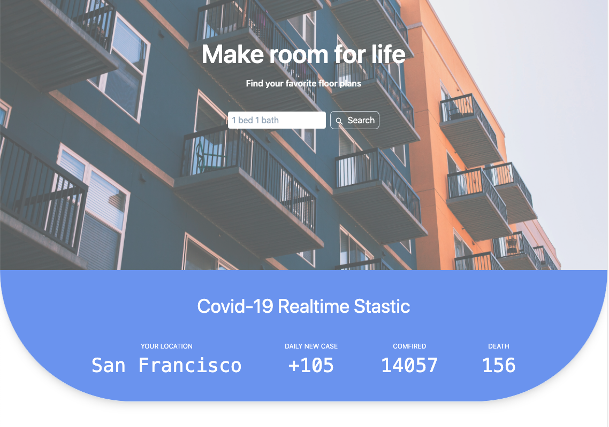

# API name: lookup

source: https://www.iplocate.io/api/lookup/

## API description:

IPLocate.io provides a simple API to return geographic information for IP addresses - such as country, city, continent, timezone, and more.

## Usage:

To look up the users' location through their ip.

# API name: COVID-19 data

source: https://rapidapi.com/Gramzivi/api/covid-19-data/details

## API description:

Collect information from several reliable sources, like Johns Hopkins CSSE, CDC, WHO and a few others.Every country sends official reports differently. From once per day to every hour. That depends on the scale of the pandemic and the time zone.

## Usage:

Use the looked up city location of the user to get the latest Covid_19 information: comfired case, daily new case and death case.

Data from the APIs will be updated every time the page refreshes.

